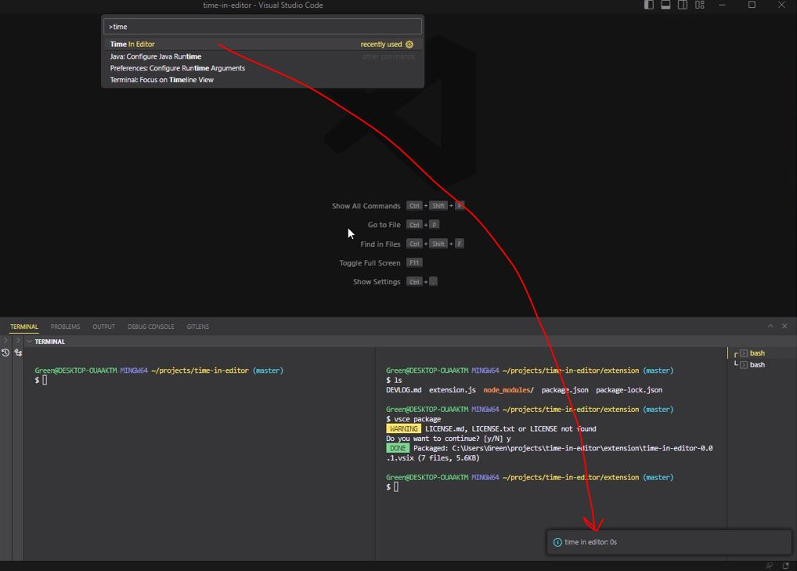

### About

This just tracks how long the editor was active for.

I know these extensions exists, I wanted to learn how to make my own.

### Uses `vscode.workspace.onDidChangeTextDocument`

Everytime you type in a panel, it logs a second if a second has elapsed from last keystroke. The seconds are added up per folder name then using the command palette (`cmd + shift + p`) show the time elapsed by finding `Time In Editor`.

### To compile

Have `@vscode/vsce` package installed globally, `vsce package`, then install by right of extension search, install by VSIX option

[Resource](https://code.visualstudio.com/api/working-with-extensions/publishing-extension)

### Based on this VS Code extension sample code

[sample code](https://github.com/microsoft/vscode-extension-samples/tree/main/helloworld-minimal-sample)
